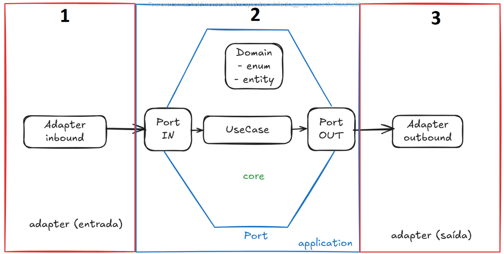

# Hexagonal Architecture with Microservices, Spring, MongoDB & Kafka

Welcome to the **Hexagonal Architecture Microservices Project**! This project demonstrates how to build microservices using **Spring Boot**, **MongoDB**, and **Kafka** while following the principles of **Hexagonal Architecture**. It's designed to be easy to understand and extend.

<div align="center">
  
  <p><em>The Hexagonal Architecture (Ports and Adapters) pattern separates core business logic from external dependencies</em></p>
</div>

## 🚀 Features

- **Hexagonal Architecture**: A clean way to structure your code.
- **Spring Boot**: Fast and easy Java-based framework for building web applications.
- **MongoDB**: NoSQL database to store your data.
- **Kafka**: Powerful tool for handling real-time data streams.
- **OpenAPI (Swagger)**: Documentation for your APIs automatically generated.
- **MapStruct**: Automatic mapping between objects to reduce boilerplate code.

## 🧑‍💻 Project Setup

To get started with the project, follow these steps:

### Prerequisites

- JDK 17 or higher
- Maven or Gradle
- MongoDB
- Kafka

### How to Run Locally

1. Clone this repository:
   ```bash
   git clone https://github.com/yourusername/hexagonal-architecture-microservices-spring-mongo-kafka.git
   ```

2. Navigate to the project folder:
   ```bash
   cd hexagonal-architecture-microservices-spring-mongo-kafka
   ```

3. Build and run the project with Gradle:
   ```bash
   ./gradlew bootRun
   ```

   Or with Maven:
   ```bash
   ./mvnw spring-boot:run
   ```

4. Once the application is running, you can access the API documentation at:
   ```
   http://localhost:8080/swagger-ui.html
   ```

## 🔧 Technologies Used

- **Spring Boot** for the application framework.
- **MongoDB** as the database for storing data.
- **Kafka** for messaging and real-time event processing.
- **Spring Cloud OpenFeign** for easy communication between microservices.
- **MapStruct** for simplifying object mapping.
- **SonarQube** for continuous code quality inspection.

## 🧪 Testing

The project includes tests to ensure the application works as expected. To run the tests, simply use:

```bash
./gradlew test
```

Or with Maven:

```bash
./mvnw test
```

Here’s a more concise and creative version of the README:

---

**Inspired by the amazing [Hexagonal Architecture Course](https://www.udemy.com/course/arquitetura-hexagonal-ou-ports-and-adapters-na-pratica/?couponCode=KEEPLEARNINGBR) on Udemy.**  
Check out the original project on GitHub: [Hexagonal Architecture GitHub](https://github.com/DaniloArantesSilva/hexagonal-architecture).

---

This version highlights the essentials and gives credit in a friendly, easy-to-read way!

## 🌱 Contributing

Feel free to fork the repository, make changes, and submit pull requests. If you find any bugs or have suggestions, please open an issue!
